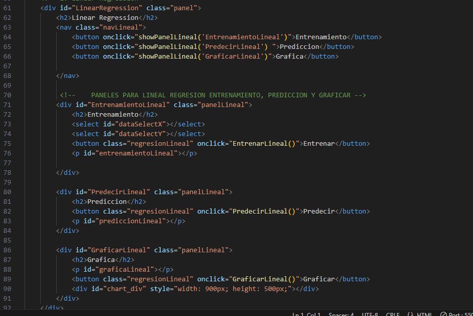
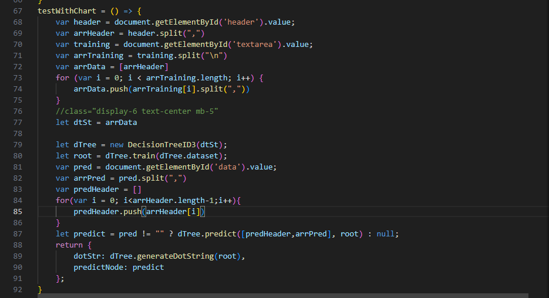

# Manual Tecnico
# IA1_Proyecto2
## Jose Castro Sincu

## El programa consta con los archivos siguientes:
*   index.html : Donde se contruyo la interfaz grafica.
*   styles.css : Se definieron los estilos de los componentes
*   funciones_principales.js : Aqui se definieron la lectura del archivo csv y manejo de paneles.
*   LinearRegresion.js : Contiene todo la informacion  de entrenamiento, prediccion y grafica.
*   Kmeans.js  : Contiene las oformacion de modelo kmeans
*   tree.js : Contiene los campos para el entrenamiento del arbol de desicion.
*   tytys.js : Libreria donde contiene las funciones necesarias para el programa.

## Index.html
*   Menu: En seccion tenemmos las opciones en el menu:
    *   Archivo: Se carga el archivo csv.
    *   Algoritmo : Se muestran los modelos existentes.
    *   Acerca de : Datos del estudiante.

*   Contenido Panel Lineal Regresion:
    *   Entrenamiento : En el entrenamiento le mandamos 2 conjuntos de datos para entrenar el modelo
    *   Prediccion: Pide un array de dentradas para predecir los datos.
    *   Graficar: Nos muestra la grafica del modelo

* Contenido Panel de Arbol de decision:
  * Header: Contiene las cabeceras del modelo
  * Training: Entrena el modelo con los datos dados.
  * Predict: Predice el modelo con el dato que se desea analizar
  * Graficar: Genera el arbol de desicion

* Contenido Panel de Kmeans:
  * Kmeans Lineal: Solo se trabaja con datos en el eje x
    * Parametros:
      * Cluster
      * Datos
      * Iteracciones
  * Kmenas 2D: Se trabaja con las 2 dimensiones.
    * Parametros:
      * Cluster
      * Datos
      * Iteracciones

*   Scritp: Las funciones llamadas en archivos externos
   

## Funciones_Principales.js

En este archivo contiene las funciones principales como:

*   contenidoCSV : Variable donde se almacena todo el contenido del archivo CSV.
*    handleFile: Funcion que nos perminte leer el archivo csv
*    showPanel: Interactua y nos muestra los paneles de los modelos.
*    showPanelLineal: Nos mustra las opciones que tiene el modelo de regresion lineal.
*    showPanelKmeans: Nos mustra las opciones que tiene el modelo de kmeans.
   

## LinearRegresion.js

Contiene las siguientes funciones:

*   EntrenarLineal: Entrena el modelo
*   PredecirLineal: Predice los datos
*   GraficarLineal: Gracifa los datos
*   drawChart: Usar la libreria y retorna un objeto a graficar

## Tree.js

Contiene las siguientes funciones:

*   funcionFlecha: Se genera el codigo para graficar el tree.
*   testWithChart: Libreria de google para retornar el objeto.

## Kmeans.js

Contiene las siguientes funciones:

*   Funcion Flecha: Funcion que permite obtener toda la informacion
*   drawArt: Retorna el objeto a graficar.

