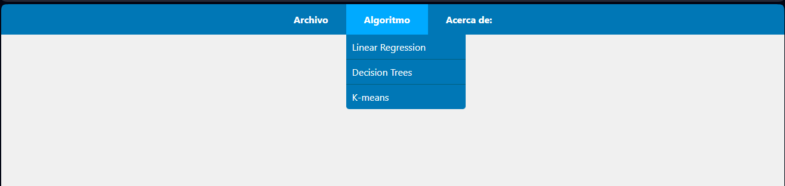

# Manual De Usuario
# IA1_Proyecto2
## Jose Castro Sincu

## Menu Principal de la pagina web
*   Archivo:    Donde se selecciona el archivo
*   Algoritmo: Se selecciona el modelo.
*   Acerca de:   Contiene la informacion del estudiante.

## Cargar Archivo CSV

Se selecciona el archivo y se busca que modelo a cargar

## Algoritmo

En esta opcion se encuentran los siguientes modelos y se selecciona al modelo a querer usar

*   Linear Regresion
*   Desicion Trees
*   Kmenas

Al seleccionar los modelos de regresion lineal nos da las opciones siguietes:

* Entrenamiento
* Prediccion
* Graficar

* Entrenamiento: Seleccionamos las columnas a desear Usar

* Prediccion: Nos pidira una array de datos a evaluar:

* Graficar: Graficamos el modelo lineal

## Arbol de Decision

El arbol de desicion cuenta con las siguientes opciones:

* header: Datos del nodo
* Training: Datos para entrenar con el modelo
* Predict: La prediccion que queremos hacer
* Graficar: Genera la grafica con los datos cargados

## Kmeans

El modelos Kmenas cuenta con las siguientes opciones:

*   Lineal:
    *   Cluster
    *   Datos
    *   Iteraccion
*   2D:
    *   Cluster
    *   Datos
    *   Iteraccion

## Acerca de:

 Contiene los datos del estudiante

